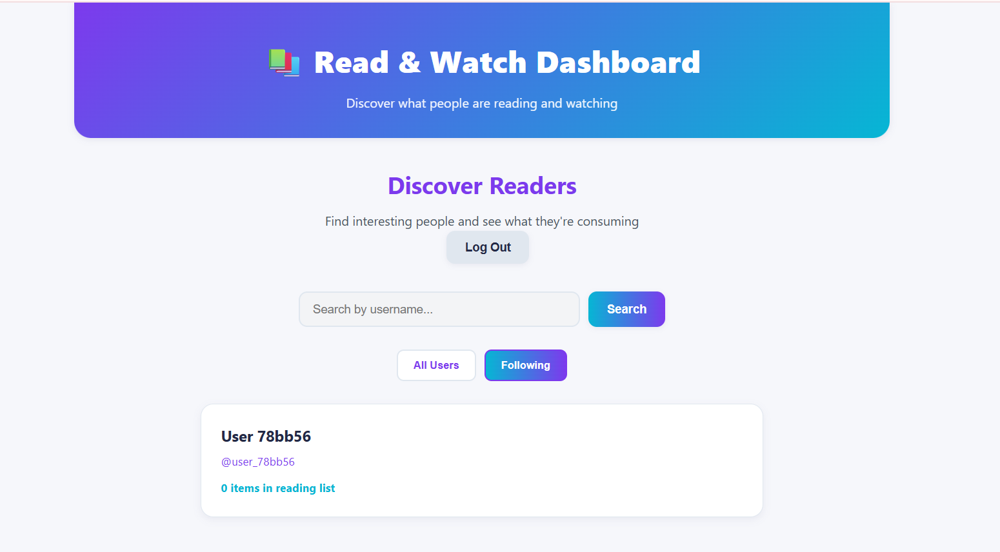
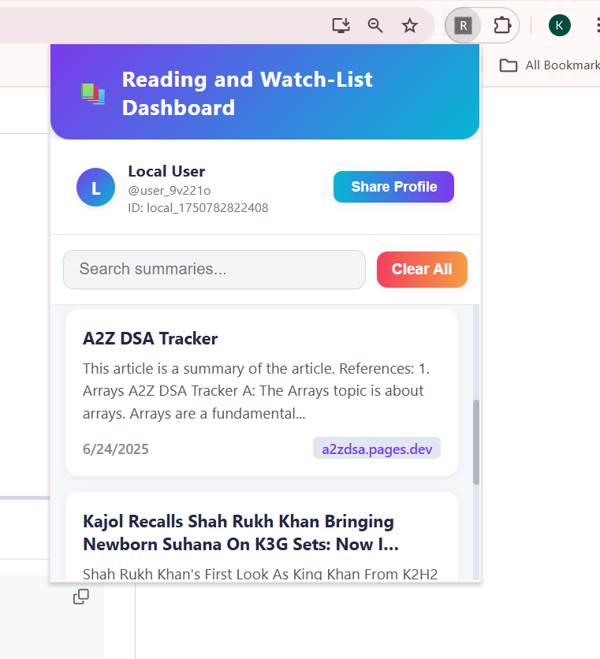
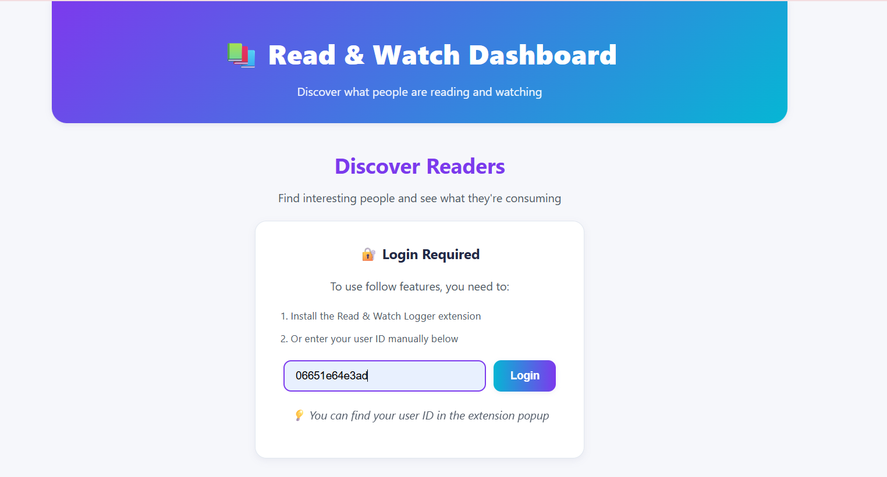

# Reading and Watch-List Dashboard Web App

## 📚 Project Description

**Read & Watch Logger** is a web-based platform and browser extension that allows users to:
- Save, summarize, and organize articles or videos they read/watch online.
- Maintain a personal reading list with summaries and links.
- Discover and follow other users, view their public reading lists, and build a social network around shared interests.
- Option to clear their browsing history.

This project includes:
- A Node.js + Express backend with SQLite for persistent storage.
- A frontend web app for user interaction and discovery.
- Chrome extension integration for seamless user experience.

---

## ✨ Features

- **User Profiles:** Unique user accounts with customizable usernames and display names.
- **Reading List:** Add, view, and clear articles/videos with summaries and types (e.g., article, video).
- **Social Discovery:** Browse users, view their reading lists, and see stats.
- **Follow System:** Follow/unfollow users, see your following/followers, and check follow status.
- **Robust Login:** Automatic validation of user identity, with a user-friendly logout and account switch option.
- **Manual Login:** Enter your user ID manually if needed.
- **Extension Integration:** Chrome extension can set and retrieve user identity for seamless experience.

---

## 🚀 Getting Started

### 1. **Clone the Repository**
```bash
git clone <your-repo-url>
cd readwriteex
```

### 2. **Install Dependencies**
```bash
npm install
```

### 3. **Run the Backend Server**
```bash
node server.js
```
- The server will start on `http://localhost:3000` by default.
- A SQLite database (`profiles.db`) will be created automatically.

### 4. **Run the Frontend Web App**
- Open your browser and go to: [http://localhost:3000](http://localhost:3000)
- The web app is served from the `public/` directory.

### 5. **Load the Chrome Extension**
- Go to `chrome://extensions` in your browser.
- Enable "Developer mode".
- Click "Load unpacked" and select the extension directory (if provided).
- The extension will help set your user ID automatically.

### 6. **Testing the App**
- Create a user by logging in or using the extension.
- Add items to your reading list.
- Browse public users and follow/unfollow them.
- Use the logout button to switch accounts or test login flow.

---

## ⚙️ Project Structure
```
readwriteex/
├── README.md
├── profiles.db
├── server.js
├── panel.js
├── panel.html
├── bg.js
├── summarise.js
├── style.css
├── package-lock.json
├── package.json
├── manifest.json
├── db-viewer.js
├── .gitignore
├── .DS_Store
├── public/
│   ├── app.js
│   ├── styles.css
│   └── index.html
├── webllm/
│   ├── webllm-runner.js
│   ├── webllm-runner.html
│   ├── webllm-loader.js
│   ├── styles.css
│   ├── .DS_Store
│   ├── lib/
│   │   └── webllm-bundle.js
│   └── models/
│       ├── .DS_Store
│       └── TinyLlama-1.1B-Chat-v0.4-q4f16_1-MLC/
│           ├── .git/
│           ├── .gitattributes
│           ├── README.md
│           ├── ndarray-cache.json
│           ├── mlc-chat-config.json
│           ├── added_tokens.json
│           └── logs.txt
├── node_modules/
│   └── ... (dependencies)
```

---

##  Screenshots

Here’s a quick visual walkthrough of the app and extension features:

### 1. **Discover Readers Page**


> The main landing page where you can search for users, view public reading lists, follow/unfollow users, and manage your profile. The “Log Out” button makes switching accounts simple.

---

### 2. **Extension Popup**

> The Chrome extension popup shows your current user ID, lets you view and search your articles, and includes a quick “Clear All” option for your reading list.

---

### 3. **User Page View**

> A user’s profile includes their display name, username, and a scrollable view of all saved content, with summaries and timestamps. You can follow users directly from this page.
> Each item in your reading list includes the title, summary, source link, content type (article/video), and the date it was added — all summarized locally via LLM.


---

### 4. **Login Prompt**

> If you are not logged in, the app will guide you to enter your user ID present in your profile (extension popup)

---

### **Potential Enhancements**
- OAuth or email-based login for easier account recovery.
- Notifications for new followers or reading list updates.
- Advanced search and filtering for public reading lists.
- Mobile-friendly UI improvements.
- Export/import reading lists.

---

## ✅ Verification Checklist
- [x] User login and validation works as expected
- [x] Reading list CRUD operations function correctly
- [x] Follow/unfollow and social features are robust
- [x] Logout and account switching is seamless

---

📌 Curious about how the backend, frontend, and Chrome extension work together? [See how the core logic fits in →](code_doc.md)

---
## 📚 Useful Resources
- [Express.js Documentation](https://expressjs.com/)
- [SQLite Documentation](https://www.sqlite.org/docs.html)
- [Chrome Extension Developer Guide](https://developer.chrome.com/docs/extensions/)
- [WebLLM Project (for LLM integration)](https://github.com/mlc-ai/web-llm)
---


## 📬 Feedback & Contributions

Feel free to open issues or submit pull requests for improvements, bug fixes, or new features! 
